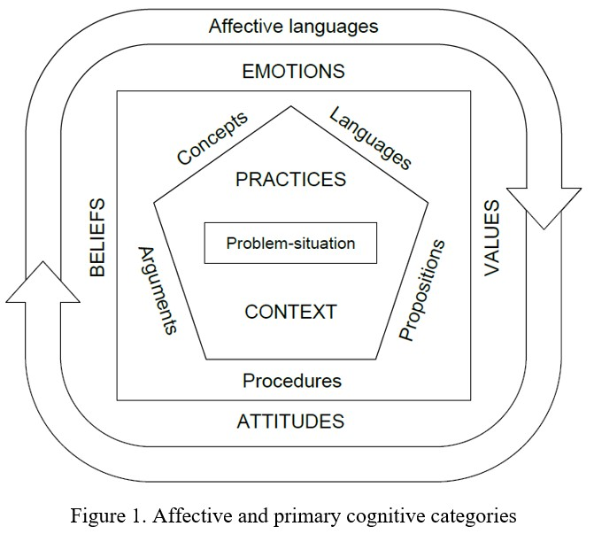
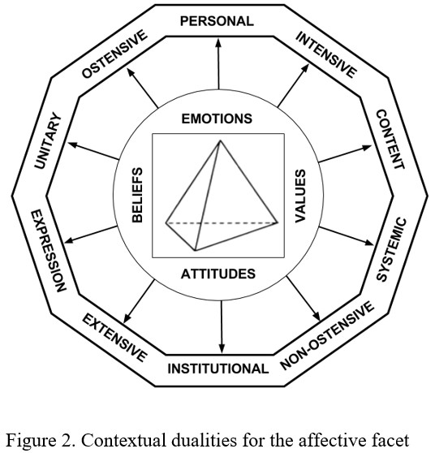
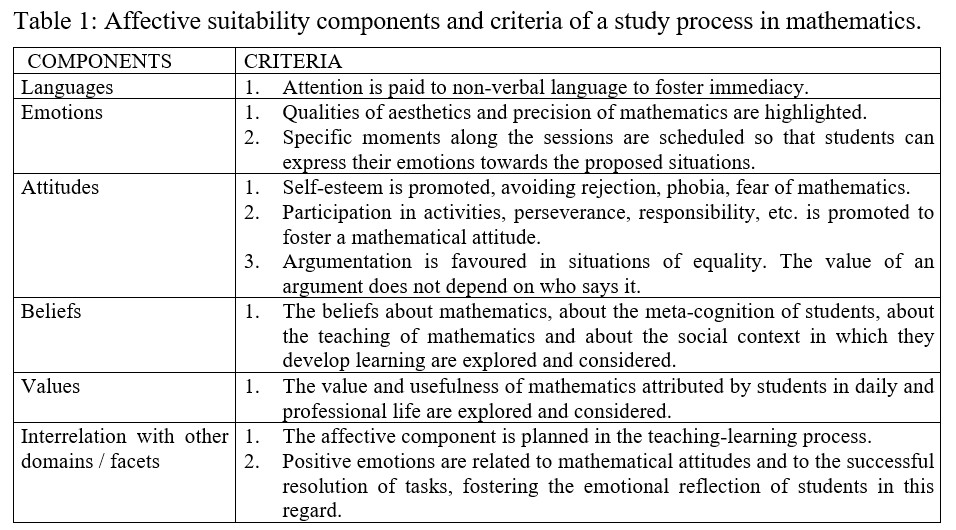

# Acceso a la presentación {data-background-image="assets/art/pc.jpg" data-background-opacity="0.25"}

## {data-background-image="assets/art/pc.jpg" data-background-opacity="0.18"}

{width=50%}

[https://pbeltran.github.io/afectoeos-feb2020](http://pbeltran.github.io/afectoeos-feb2020)

# Introduction

## Introduction

The OSA has been applied to the epistemic (institutional knowledge) and cognitive (personal or subjective knowledge) domain, taking as primitive notions the following: 

- Situation-problem
- Practice (mathematics)
- Object (emerging and intervening in practices)
- Meaning (relation between objects) (Font, et al., 2013). 

## Introduction

These primary entities can be analysed from different points of view (dualities or contextual polarities), giving rise to new types of secondary entities: personal-institutional, ostensive-non-ostensive, extensive-intensive, unitary-systemic, expression-content. 

> Our purpose here is to address the following questions: Is an onto-semiotic approach relevant to the study of the affective domain? Is it possible to bring new insights to affect in mathematics education when tackling it with the OSA theoretical lenses? What theoretical models on affect can be incorporated and aligned with this approach?

# Affect and mathematics education

## Affect and mathematics education

Anyway, most researchers accept emotions, attitudes, beliefs and values as the key components of the affective domain in mathematics education and use them to study the interactions among cognition, mathematical affect, teaching and learning processes, problem solving, achievement and behaviour (Grootenboer & Marshman, 2016; Pepin & Roesken-Winter, 2015). 

##

One of these interactions is the mediation of beliefs in the learning itself. Furinghetti and Pehkonen (2002) suggest that beliefs can be considered also as a form of subjective knowledge and thus they can be interpreted as a nexus between the cognitive and the affective domains. 

Besides, there are also complex interactions between teacher and student beliefs, particularly in problem-solving approaches and ICT mediation (Depaepe, De Corte, & Verschaffel, 2015; Gómez-Chacón, 2011).

##

Our literature review suggests that there is a clear interest in deepening how the different facets of the affective domain interact among them and with other domains, for what an onto-semiotic approach can be useful, as it incorporates theoretical notions to handle the multiple facets of a mathematics learning and teaching process. 

# Method

## Didactical fact

A didactical fact is ‘any event that has a place and a time in the becoming of a mathematical instruction process and that, for some reason, is considered as a unit’ (Wilhelmi, Font, &Godino, 2005). We will say that it is a meaningful didactic fact (MDF) ‘if the didactic actions or practices that compose it play a role, or admit an interpretation, in terms of the intended instructional objective’ (Godino, Rivas, Arteaga, Lasa, & Wilhelmi, 2014).

To support the description and understanding of the categories of affective entities, we will apply the notion of MDF to two experiences made in different educational and research contexts. 

The selected MDF from both data sources allow us to illustrate specific aspects of the affective domain, as we will see below, through the OSA categories.

# Primary affective entities

## Affective meaning of certain signs

Following the OSA pragmatic epistemological assumptions, we are now asking for the affective meaning of certain signs (in the sense of Peirce’s representamen), in any of the possible registers and representations, which may be verbal or written expressions, observable behaviours, etc. Such meaning must be sought in the systems of practices that a person performs to solve a problem situation, or towards a practice, an object, a mathematical process, or any mathematics study situation.

## Affective domain components

There is agreement, within the scope of research in mathematical education, that the affective domain consists of three components: emotions, attitudes and beliefs. The origins of this classification go back to McLeod (1992) and, in this article, we will use this ontology of affective objects, to which we will add the values, construct included in the model of DeBellis & Goldin (2006).

## Affective situations

It is necessary to consider a specific type of situation that provides the appropriate framework for describing affective practices. When a student is confronted with a situation-problem, an affective situation occurs that juxtaposes itself with the cognitive one, and which comes to include the purely personal meanings about it, in the form of emotions, attitudes, beliefs or values. 

However, affective situations do not arise solely in response to a problem-situation, since the teaching and learning ecosystems provide constant reference points for the affective domain. In this way, there are situations of production, communication or, simply, of individual mathematical study. 

The teacher may pose situations in which, specifically, the students' beliefs are brought into play towards a concrete mathematical object.

## Affective practices 

Affective practices are any action or affective manifestation that accompanies any mathematical practice. 

They can be manifestations about emotions, attitudes, beliefs or values about the objects put into play. Each of these affect expressions can vary in intensity throughout a practice or even disappear, giving rise to new manifestations. The great part of the affective trajectory remains hidden from the eyes of the teacher, because not all the affective states are manifested. Besides, it is not possible for a single person to observe the whole group to interpret small gestures or signs of every student.

##

Nevertheless, an observation record, as a classroom diary (Porlán and Martín, 1991), helps to collect data on which to reflect later. And, in addition, there are instruments that can be incorporated into the teaching practice to gather information about the affective domain. 

## Intervening and emerging objects
	
Although the categorisation of the affective domain in emotions, attitudes and beliefs is accepted by the research community, to which values can be added, the meaning of such constructs is still a matter of controversy:

- Emotions: quickly changing feelings experienced in a conscious way or occurring pre-consciously or unconsciously during mathematical (or other) activity. Emotions vary from mild to intense and are locally and contextually immersed. 
- Attitudes: describe orientations or predispositions towards certain sets of emotional sensations (positive or negative), in particular (mathematical) contexts. This differs from the more common view of attitudes as predispositions toward certain patterns of behaviour. Attitudes are moderately stable, implying an interactive balance between affection and cognition.

## Intervening and emerging objects

- Beliefs: they imply the attribution of some kind of truth or external validity to the system of propositions or other cognitive configurations. Beliefs are often highly stable, largely cognitive and structured, in which emotions and attitudes intersect with them, contributing to their stabilisation.
- Values: including ethical and moral components, refers to personal truths or commitments deeply appreciated by individuals. They help to motivate long-term decisions or set short-term priorities. They can be highly structured, building value systems.

##

Given the interaction with the cognitive domain, it may be convenient to consider, as a category of affective objects, the various modes of expression of the affects: gestures, terms of ordinary language, etc. (Álvarez, 2012), which would constitute the ostensible facet of affections. Emotions, attitudes, beliefs and values are relative to mathematical situations and practices, and to the distinct primary mathematical objects. It makes sense, therefore, to research the affective components towards the demonstrations, the procedures, the representations, etc. 

##

{width=65%}  

# Contextual dualities

##

{width=65%}  

# Final reflections

## 

The affective facet is perhaps the most complex to evaluate within the six facets that make up the didactical suitability in the OSA, and an initial proposal was suggested in Godino (2013). Didactical suitability is understood as the degree to which an instructional process (or a part of it) combines certain characteristics in order to be classified as suitable (optimal or appropriate) for the adaptation between the personal meanings obtained by students (learning), and the intended or implemented institutional meanings (teaching), taking into consideration the circumstances and the available resources (environment).

##

{width=75%}  

##

The literature review clearly indicates that the relationship with the students’ perception of their own learning influences their own progress. There is also a certain correlation between affection and degree of cognitive performance, although more studies are needed in this line (Gómez-Chacón, 2017).

This work constitutes an advance within the OSA theoretical framework, when applying their primary categories and their ontology to the affective domain of the teaching-learning processes. The pertinence of the study is reflected both in the articulating nature between representational systems of theoretical models and in the revision of the original criteria on affective suitability proposed by Godino (2013).

# Créditos y referencias {data-background-image="assets/art/credits.jpg" data-background-opacity="0.1"} 

## Referencias

Las referencias mencionadas pueden encontrarse en el artículo completo:

Beltrán-Pellicer, P., & Godino, J. D. (2020). An onto-semiotic approach to the analysis of the affective domain in mathematics education. _Cambridge Journal of Education, 50_(1), 1-20. DOI: [10.1080/0305764X.2019.1623175](https://www.tandfonline.com/doi/full/10.1080/0305764X.2019.1623175)

## Créditos {data-background-image="assets/art/credits.jpg" data-background-opacity="0.1"}

_Compartir el conocimiento de forma libre es una buena práctica._

En estas diapositivas se han utilizado materiales disponibles en abierto y se han citado las fuentes correspondientes. El contenido de la presentación está publicado con licencia Creative Common [CC-BY-SA-4.0](https://creativecommons.org/licenses/by-sa/4.0/legalcode.es), lo que quiere decir que puedes compartirla y adaptarla, citando al autor (Pablo Beltrán-Pellicer) y poniendo un enlace a [http://pbeltran.github.io/afectoeos-feb2020](http://pbeltran.github.io/afectoeos-feb2020)

_Siéntete libre de trabajar con este material y de contactar conmigo para compartir tus reflexiones._

## {data-background-image="assets/art/credits.jpg" data-background-opacity="0.1"}

Presentación realizada con  <a href="https://revealjs.com/#/">Reveal.js</a>, <a href="https://pandoc.org/">Pandoc</a>, <a href="https://www.mathjax.org/">MathJax</a> y <a href="https://www.markdownguide.org/">Markdown</a>. 

La fuente de las imágenes es propia, salvo las que se ha citado la fuente en su diapositiva y las de dominio público obtenidas en [Unsplash](https://unsplash.com).

